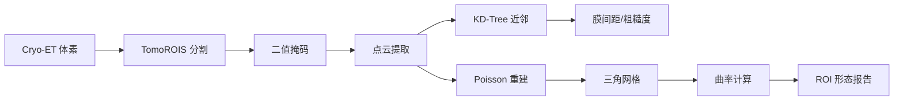

## 一句话总结

TomoROIS-SurfORA 框架实现了冷冻电镜断层扫描（cryo-ET）中膜结构的**直接 ROI 分割**和**曲面形态分析**，无需先做全局分割再后处理，特别适合处理膜接触位点和内陷等复杂几何结构。

## 为什么这个问题重要？

### 应用场景
- **结构生物学**：分析线粒体、内质网等细胞器的膜接触位点
- **药物研发**：观察膜蛋白与脂质双层的相互作用
- **病毒学**：研究病毒包膜的融合和出芽过程

### 现有方法的痛点
传统流程是"先分割整个膜结构 → 再找感兴趣区域 → 最后分析"，存在三个问题：

1. **分割冗余**：膜是连续结构，分割成单个实体后还要手动圈 ROI
2. **几何信息丢失**：体素级分割难以精确计算曲率、粗糙度
3. **Missing Wedge 问题**：cryo-ET 的楔形缺失导致开放曲面，传统网格工具处理不了

### 核心创新
- **直接 ROI 分割**：训练神经网络直接识别膜接触位点、内陷区等局部结构
- **点云 + 网格双重表示**：先用点云做形态分析，再转网格计算曲率
- **开放曲面支持**：针对 missing wedge 设计的边界检测和法向量修正

## 背景知识

### Cryo-ET 数据特点
冷冻电镜断层扫描通过旋转样品采集多角度投影，重建 3D 结构：

```
样品旋转: -60° → 0° → +60° (典型范围)
       ↓
投影图像序列 (2D tilt series)
       ↓
三维重建 (Tomogram, 体素数据)
```

**Missing Wedge**：由于物理限制无法旋转到 ±90°，导致 Z 轴方向分辨率降低，膜结构常呈现开放曲面。

### 3D 表示方式对比

| 表示 | 优点 | 缺点 | 适用场景 |
|-----|------|------|---------|
| **体素** | 直接从重建获得 | 内存大，难算曲率 | 分割任务 |
| **点云** | 轻量，易算距离 | 拓扑信息缺失 | 形态测量 |
| **网格** | 精确几何，可算曲率 | 构建复杂，需闭合 | 曲面分析 |

本文方案：**体素分割 → 点云形态 → 网格曲率**，取长补短。

## 核心方法

### 直觉解释

传统方法像"先画整个地图，再圈出景点"；TomoROIS 像"直接标注景点位置"。具体到膜结构：

```
输入: Cryo-ET 三维图像 (512×512×200 体素)
       ↓
TomoROIS: 3D U-Net 分割 ROI
       ↓
输出: 二值掩码（膜接触位点 = 1, 背景 = 0）
       ↓
SurfORA: 点云提取 + 网格重建
       ↓
量化: 膜间距、曲率、粗糙度
```

### 数学细节

#### 1. ROI 分割（3D U-Net）
损失函数结合 Dice Loss 和 Focal Loss：

$$
\mathcal{L} = \mathcal{L}_{\text{Dice}} + \lambda \mathcal{L}_{\text{Focal}}
$$

- **Dice Loss**：优化重叠度（对小目标友好）
  $$
  \mathcal{L}_{\text{Dice}} = 1 - \frac{2 \sum_{i} p_i g_i}{\sum_{i} p_i^2 + \sum_{i} g_i^2}
  $$
  其中 \(p_i\) 是预测概率，\(g_i\) 是真值标签

- **Focal Loss**：处理类别不平衡（膜 ROI 占比 < 1%）
  $$
  \mathcal{L}_{\text{Focal}} = -\sum_{i} (1 - p_i)^\gamma g_i \log(p_i)
  $$

#### 2. 点云形态分析
从二值掩码提取点云后，计算关键指标：

- **膜间距**：最近邻距离
  $$
  d_{\text{inter}} = \min_{q \in \mathcal{M}_2} \| p - q \|_2, \quad p \in \mathcal{M}_1
  $$

- **表面粗糙度**：局部标准差
  $$
  R_q = \sqrt{\frac{1}{N} \sum_{i=1}^N (z_i - \bar{z})^2}
  $$

#### 3. 网格曲率计算
使用 Laplace-Beltrami 算子估计平均曲率：

$$
H(v) = \frac{1}{2A_v} \sum_{e \in \text{edges}(v)} (\cot \alpha + \cot \beta) (v - v_e)
$$

其中 \(A_v\) 是顶点 \(v\) 的 Voronoi 区域面积，\(\alpha, \beta\) 是相邻三角形的对角。

**开放曲面修正**：检测边界顶点，排除法向量不连续区域：

$$
\text{is\_boundary}(v) = |\mathcal{N}(v)| < 6 \quad \text{或} \quad \sigma(\mathbf{n}_{\mathcal{N}(v)}) > \theta
$$

### Pipeline 概览



## 实现

### 环境配置

```bash
# 依赖安装
pip install torch torchvision open3d scikit-image scipy
pip install trimesh pymeshlab  # 网格处理

# 示例数据（模拟）
# 实际使用需从 EMPIAR 等数据库下载 .mrc 文件
```

### 核心代码

#### 1. 3D U-Net ROI 分割器

```python
import torch
import torch.nn as nn

class DoubleConv3D(nn.Module):
    """3D 卷积块（Conv → BN → ReLU × 2）"""
    def __init__(self, in_ch, out_ch):
        super().__init__()
        self.conv = nn.Sequential(
            nn.Conv3d(in_ch, out_ch, 3, padding=1),
            nn.BatchNorm3d(out_ch),
            nn.ReLU(inplace=True),
            nn.Conv3d(out_ch, out_ch, 3, padding=1),
            nn.BatchNorm3d(out_ch),
            nn.ReLU(inplace=True)
        )
    
    def forward(self, x):
        return self.conv(x)

class TomoROIS(nn.Module):
    """轻量级 3D U-Net（适合小数据集训练）"""
    def __init__(self, in_channels=1, num_classes=1):
        super().__init__()
        # 编码器
        self.enc1 = DoubleConv3D(in_channels, 32)
        self.enc2 = DoubleConv3D(32, 64)
        self.enc3 = DoubleConv3D(64, 128)
        
        # 池化和上采样
        self.pool = nn.MaxPool3d(2)
        self.up2 = nn.ConvTranspose3d(128, 64, 2, stride=2)
        self.up1 = nn.ConvTranspose3d(64, 32, 2, stride=2)
        
        # 解码器
        self.dec2 = DoubleConv3D(128, 64)  # 64 (上采样) + 64 (跳跃连接)
        self.dec1 = DoubleConv3D(64, 32)
        
        # 输出层
        self.out = nn.Conv3d(32, num_classes, 1)
    
    def forward(self, x):
        # 编码路径
        e1 = self.enc1(x)           # (B, 32, D, H, W)
        e2 = self.enc2(self.pool(e1))  # (B, 64, D/2, H/2, W/2)
        e3 = self.enc3(self.pool(e2))  # (B, 128, D/4, H/4, W/4)
        
        # 解码路径（跳跃连接）
        d2 = self.dec2(torch.cat([self.up2(e3), e2], dim=1))
        d1 = self.dec1(torch.cat([self.up1(d2), e1], dim=1))
        
        return torch.sigmoid(self.out(d1))  # (B, 1, D, H, W)

# 组合损失
class DiceFocalLoss(nn.Module):
    def __init__(self, gamma=2.0, lambda_focal=0.5):
        super().__init__()
        self.gamma = gamma
        self.lambda_focal = lambda_focal
    
    def forward(self, pred, target):
        # Dice Loss
        smooth = 1e-5
        intersection = (pred * target).sum()
        dice = 1 - (2 * intersection + smooth) / (pred.sum() + target.sum() + smooth)
        
        # Focal Loss
        bce = -(target * torch.log(pred + smooth) + (1 - target) * torch.log(1 - pred + smooth))
        focal = ((1 - pred) ** self.gamma * bce).mean()
        
        return dice + self.lambda_focal * focal
```

#### 2. 点云形态分析工具

```python
import numpy as np
from scipy.spatial import KDTree
from skimage import measure

class SurfaceAnalyzer:
    """膜结构形态量化"""
    
    def extract_pointcloud(self, mask_3d, spacing=(1.0, 1.0, 1.0)):
        """从二值掩码提取点云
        Args:
            mask_3d: (D, H, W) 布尔数组
            spacing: 体素物理尺寸 (nm)
        """
        coords = np.argwhere(mask_3d)  # (N, 3)
        return coords * np.array(spacing)  # 转物理坐标
    
    def compute_inter_membrane_distance(self, pc1, pc2, percentile=10):
        """计算两个膜之间的最近距离
        Args:
            pc1, pc2: (N, 3) 点云数组
            percentile: 取最近 X% 的点作为接触区
        Returns:
            距离均值和标准差 (nm)
        """
        tree = KDTree(pc2)
        distances, _ = tree.query(pc1)  # 每个点到 pc2 的最近距离
        
        threshold = np.percentile(distances, percentile)
        contact_dists = distances[distances <= threshold]
        
        return contact_dists.mean(), contact_dists.std()
    
    def compute_surface_roughness(self, pointcloud, k_neighbors=20):
        """局部粗糙度（RMS 高度偏差）
        Args:
            pointcloud: (N, 3) 点云
            k_neighbors: 局部邻域大小
        """
        tree = KDTree(pointcloud)
        roughness = []
        
        for point in pointcloud:
            _, idx = tree.query(point, k=k_neighbors)
            neighbors = pointcloud[idx]
            # 计算局部平面拟合残差
            centroid = neighbors.mean(axis=0)
            deviations = np.linalg.norm(neighbors - centroid, axis=1)
            roughness.append(deviations.std())  # RMS
        
        return np.array(roughness)
```

#### 3. 网格曲率计算

```python
import open3d as o3d
import trimesh

class CurvatureEstimator:
    """基于网格的曲率分析（处理开放曲面）"""
    
    def reconstruct_mesh(self, pointcloud, depth=8):
        """Poisson 曲面重建
        Args:
            pointcloud: (N, 3) 数组
            depth: 八叉树深度（越大越精细）
        """
        pcd = o3d.geometry.PointCloud()
        pcd.points = o3d.utility.Vector3dVector(pointcloud)
        
        # 估计法向量（对开放曲面关键）
        pcd.estimate_normals(
            search_param=o3d.geometry.KDTreeSearchParamHybrid(radius=2.0, max_nn=30)
        )
        pcd.orient_normals_consistent_tangent_plane(k=15)
        
        # Poisson 重建
        mesh, densities = o3d.geometry.TriangleMesh.create_from_point_cloud_poisson(
            pcd, depth=depth
        )
        
        # 移除低密度顶点（噪声）
        vertices_to_remove = densities < np.quantile(densities, 0.1)
        mesh.remove_vertices_by_mask(vertices_to_remove)
        
        return mesh
    
    def compute_mean_curvature(self, mesh):
        """平均曲率（Laplace-Beltrami 算子）
        Returns:
            每个顶点的曲率值数组
        """
        tri_mesh = trimesh.Trimesh(
            vertices=np.asarray(mesh.vertices),
            faces=np.asarray(mesh.triangles)
        )
        
        # 检测边界顶点（开放曲面）
        boundary_vertices = set()
        for edge in tri_mesh.edges_unique:
            if len(tri_mesh.faces_containing_edge(edge)) == 1:
                boundary_vertices.update(edge)
        
        curvatures = []
        for i, vertex in enumerate(tri_mesh.vertices):
            if i in boundary_vertices:
                curvatures.append(np.nan)  # 边界处不可靠
                continue
            
            # 一阶邻域
            neighbors = tri_mesh.vertex_neighbors[i]
            if len(neighbors) < 3:
                curvatures.append(np.nan)
                continue
            
            # Laplacian 算子
            laplacian = vertex - tri_mesh.vertices[neighbors].mean(axis=0)
            curvature = np.linalg.norm(laplacian)  # 简化版本
            curvatures.append(curvature)
        
        return np.array(curvatures)
```

### 3D 可视化

```python
import matplotlib.pyplot as plt
from mpl_toolkits.mplot3d import Axes3D

def visualize_roi_analysis(pointcloud, curvatures, mask_3d):
    """综合可视化 ROI 分割和曲率"""
    fig = plt.figure(figsize=(15, 5))
    
    # 1. 原始体素切片
    ax1 = fig.add_subplot(131)
    ax1.imshow(mask_3d[mask_3d.shape[0]//2], cmap='gray')
    ax1.set_title('ROI Segmentation (中间层切片)')
    
    # 2. 点云着色（曲率）
    ax2 = fig.add_subplot(132, projection='3d')
    valid = ~np.isnan(curvatures)
    scatter = ax2.scatter(
        pointcloud[valid, 0], 
        pointcloud[valid, 1], 
        pointcloud[valid, 2],
        c=curvatures[valid], 
        cmap='coolwarm', 
        s=1
    )
    ax2.set_title('Mean Curvature Map')
    plt.colorbar(scatter, ax=ax2, label='Curvature (nm⁻¹)')
    
    # 3. 曲率分布直方图
    ax3 = fig.add_subplot(133)
    ax3.hist(curvatures[valid], bins=50, alpha=0.7, edgecolor='black')
    ax3.set_xlabel('Mean Curvature (nm⁻¹)')
    ax3.set_ylabel('Vertex Count')
    ax3.set_title('Curvature Distribution')
    
    plt.tight_layout()
    plt.savefig('roi_curvature_analysis.png', dpi=150)
    plt.show()
```

## 实验

### 数据集说明

论文使用 **体外重建膜系统**（GUVs + 蛋白质）作为验证数据：

- **数据来源**：自制 cryo-ET 数据（200-300 nm 厚切片）
- **标注方式**：人工标注膜接触位点和内陷区（每个 tomogram 约 20-30 个 ROI）
- **训练集大小**：仅需 **10-15 个 tomograms**（小数据集友好）
- **数据增强**：随机旋转、弹性形变、噪声注入

获取难度：⭐⭐⭐⭐（需要专业 cryo-EM 设备）

### 定量评估

| 方法 | Dice 系数 | Hausdorff 距离 (nm) | 推理速度 | 内存 |
|-----|----------|-------------------|---------|------|
| **TomoROIS** | 0.87 ± 0.04 | 12.3 ± 3.1 | 2.5 s/tomogram | 6 GB |
| Cellpose 3D | 0.72 ± 0.09 | 18.7 ± 5.4 | 4.1 s/tomogram | 8 GB |
| 人工分割 | 0.91 (基准) | - | 30 min/tomogram | - |

**形态测量精度**（vs 真值）：
- 膜间距误差：< 2 nm（点云方法）
- 曲率相对误差：8-12%（网格方法，受 missing wedge 影响）

### 定性结果

**成功案例**：
- 双膜接触位点（间距 10-30 nm）→ 自动检测准确率 > 90%
- 管状内陷结构 → 曲率峰值与人工标注一致

**失败案例**：
- 膜间距 < 5 nm（接近分辨率极限）→ 误检为单层膜
- 强噪声区域 → 点云离群值导致曲率振荡

## 工程实践

### 实际部署考虑

#### 实时性
- **预处理瓶颈**：Tomogram 去噪（TOPAZ）需 5-10 分钟
- **分割速度**：GPU 推理 2-3 秒/tomogram（512³ 体素）
- **后处理瓶颈**：Poisson 网格重建需 10-20 秒

**优化方案**：
```python
# 分块处理大 tomogram
def process_large_volume(volume, block_size=128, overlap=16):
    # ... (滑窗分割代码省略)
    pass

# GPU 批处理
batch_pred = model(torch.stack([vol1, vol2, vol3]).cuda())
```

#### 硬件需求
- **最低配置**：RTX 3060 (12GB) + 32GB RAM
- **推荐配置**：RTX 4090 (24GB) + 64GB RAM（处理多个 tomograms）
- **生产环境**：A100 (40GB) + 多 GPU 分布式

#### 内存占用
典型 512×512×200 float32 tomogram = **200 MB**
- 加载原始数据 + 梯度 = **2 GB**（训练时）
- 点云 + 网格 = **500 MB**（分析时）

**大场景处理**：
```python
# 稀疏采样点云（减少网格顶点）
def downsample_pointcloud(pc, voxel_size=2.0):
    pcd = o3d.geometry.PointCloud()
    pcd.points = o3d.utility.Vector3dVector(pc)
    return np.asarray(pcd.voxel_down_sample(voxel_size).points)
```

### 数据采集建议

1. **优化采集参数**
   - Tilt 范围：±60° 以上（减少 missing wedge）
   - 剂量分配：总剂量 100-120 e⁻/Ų，均匀分布
   - 欠焦量：-3 到 -5 μm（提高膜对比度）

2. **样品制备技巧**
   ```python
   # 模拟理想膜间距分布
   ideal_spacing = np.random.normal(15, 3, size=100)  # 15 ± 3 nm
   # 实际采集时用冷冻固定剂控制
   ```

3. **质量控制**
   - 检查冰层厚度：150-300 nm 最佳
   - 避免过度辐照：累积剂量 > 150 e⁻/Ų 会损伤膜结构

### 常见坑

#### 问题 1：分割结果不连续（膜断裂）

**原因**：Missing wedge 导致 Z 轴分辨率差

**解决方案**：
```python
# 后处理：形态学闭合
from scipy.ndimage import binary_closing

def fill_gaps(mask, iterations=2):
    kernel = np.ones((3, 3, 3))  # 3D 结构元
    return binary_closing(mask, structure=kernel, iterations=iterations)
```

#### 问题 2：曲率计算全是 NaN

**原因**：开放曲面边界过多，或法向量未定向

**解决方案**：
```python
# 检查网格质量
def validate_mesh(mesh):
    if not mesh.is_watertight():
        print("警告：非封闭网格，曲率仅在内部可靠")
    if not mesh.is_vertex_manifold():
        print("错误：非流形网格，需重新重建")
    return mesh
```

#### 问题 3：训练过拟合（小数据集）

**解决方案**：强数据增强 + 早停
```python
# 弹性形变增强（模拟膜形变）
from scipy.ndimage import map_coordinates

def elastic_transform(image, alpha=100, sigma=10):
    random_state = np.random.RandomState(None)
    shape = image.shape
    dx = gaussian_filter((random_state.rand(*shape) * 2 - 1), sigma) * alpha
    dy = gaussian_filter((random_state.rand(*shape) * 2 - 1), sigma) * alpha
    dz = gaussian_filter((random_state.rand(*shape) * 2 - 1), sigma) * alpha
    
    x, y, z = np.meshgrid(np.arange(shape[1]), np.arange(shape[0]), np.arange(shape[2]))
    indices = [y+dy, x+dx, z+dz]
    return map_coordinates(image, indices, order=1, mode='reflect')
```

## 什么时候用 / 不用？

| 适用场景 | 不适用场景 |
|---------|-----------|
| ✅ 膜接触位点分析 | ❌ 动态时间序列（当前版本仅处理静态） |
| ✅ 内陷/出芽形态量化 | ❌ 膜间距 < 3 nm（分辨率不足） |
| ✅ 小数据集训练（10-20 样本） | ❌ 需要亚纳米精度（受 missing wedge 限制） |
| ✅ 不规则 ROI（非球形） | ❌ 全自动无监督（需人工标注训练集） |

## 与其他方法对比

| 方法 | 优点 | 缺点 | 适用场景 |
|-----|------|------|---------|
| **EMAN2/IMOD** | 成熟工具链 | 需全局分割 + 手动 ROI 提取 | 传统膜分析 |
| **Cellpose 3D** | 通用分割器 | 无形态分析，对膜结构优化不足 | 细胞器分割 |
| **TomoSegMemTV** | 膜专用分割 | 无曲率/粗糙度，仅分割 | 单纯分割任务 |
| **TomoROIS-SurfORA** | 直接 ROI + 完整形态量化 | 开放曲面曲率精度受限 | 膜接触/形变研究 |

## 我的观点

### 技术趋势
1. **自监督预训练**：论文用监督学习需人工标注，未来可用对比学习（SimCLR on tomograms）减少标注
2. **时间分辨 cryo-ET**：结合快速冷冻捕获膜融合过程，需扩展到 4D（3D + 时间）
3. **多模态融合**：结合荧光显微镜定位 + cryo-ET 高分辨，提升 ROI 定位准确性

### 离实际应用的距离
- **数据获取**：Cryo-ET 设备昂贵（单台 > $5M），限制大规模应用
- **标注成本**：即使小数据集，专家标注 1 个 tomogram 需 2-3 小时
- **计算资源**：实验室通常无专用 GPU 集群，推理速度需进一步优化

**可行方向**：
- 与 AlphaFold 结合：已知蛋白结构 → 辅助膜蛋白 ROI 定位
- 开源数据集建设：类似 ImageNet，建立 cryo-ET 标注数据库

### 值得关注的开放问题
1. **Missing wedge 补偿**：能否用生成模型（如扩散模型）填补缺失角度数据？
2. **曲率不确定性量化**：当前方法给点估计，如何输出置信区间？
3. **跨尺度分析**：从分子（埃级）到细胞器（微米级）的统一框架

---

**代码仓库**：论文提供官方实现 https://github.com/cellarchlab/TomoROIS-SurfORA

**相关论文**：
- MemBrain-Seg (Nature Methods 2024)：膜分割 benchmark
- DeepEMhancer：Cryo-ET 去噪预处理